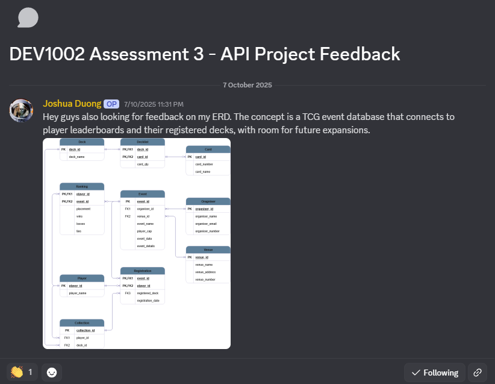

# Feedback Request 2
## Planning Stage

### Response 1: Lillie

<b>Actions taken:</b>
 - Added attributes to `cards` table:
   - `card_rarity`
   - `card_type`

### Response 2: Matt

<b>Actions taken:</b>
- Added attributes to `rankings` table:
    - `points`

- Added attributes to `events` table:
    - `status`

### Response 3: Nick

<b>Actions taken:</b>
- Fixed ERD to show a one-to-many relationship between card and decklists

    > One card can be in many decklists

 
 

# Feedback Request 1
## Programming Stage

### Response 1: Nick

<b>Actions taken:</b>
- Removed `.envexample` from the `.gitignore` list to show users how to setup their environment
- Added installation guide to the repository wiki
- Fixed comments in the cli_controller to reference this project
- Set attributes `organiser_id` and `venue_id` to be mandatory fill-ins by setting `nullable = False`

### Response 2: Lillie

<b>Actions taken:</b>
- Added `UniqueConstraints` to the `player_id` and `deck_id` in the `collections` table
- Added `CheckConstraints` to the `card_quantity` in the `decklists` table

### Response 3: Matt

<b>Actions taken:</b>
- Added validations to the `collection_schema` and the `decklist_schema`
- Changed the loading method, using the <i>table_schema</i>`.load()` method, to allow the schemas to handle the validation and adding data into their respective table fields.